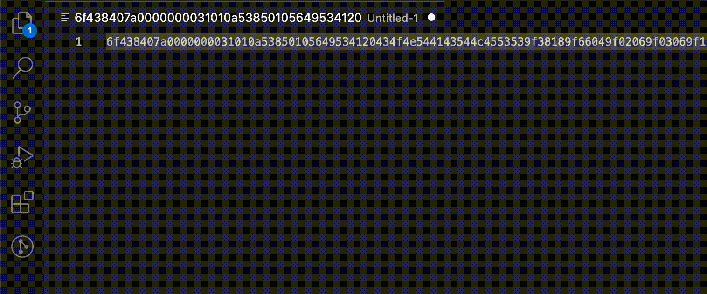

# ber-tlv-formatter README

This extension allows to quickly format a BER-TLV string into more readable one. BER-TLV definition can be found in EMV 4.3 Book 3 - Annex B.

Example:
```
6f438407a0000000031010a53850105649534120434f4e544143544c4553539f38189f66049f02069f03069f1a0295055f2a029a039c019f3704bf0c089f5a051008400840
```

is formatted in:

```
6f 43
  84 07 a0000000031010
  a5 38
    50 10 5649534120434f4e544143544c455353
    9f38 18 9f66049f02069f03069f1a0295055f2a029a039c019f3704
    bf0c 08
      9f5a 05 1008400840
```

## Usage

1. Select TLV string you want to format,
2. Use shortcut `ctrl+alt+V` to format the string or select TLV > Format from context menu.




